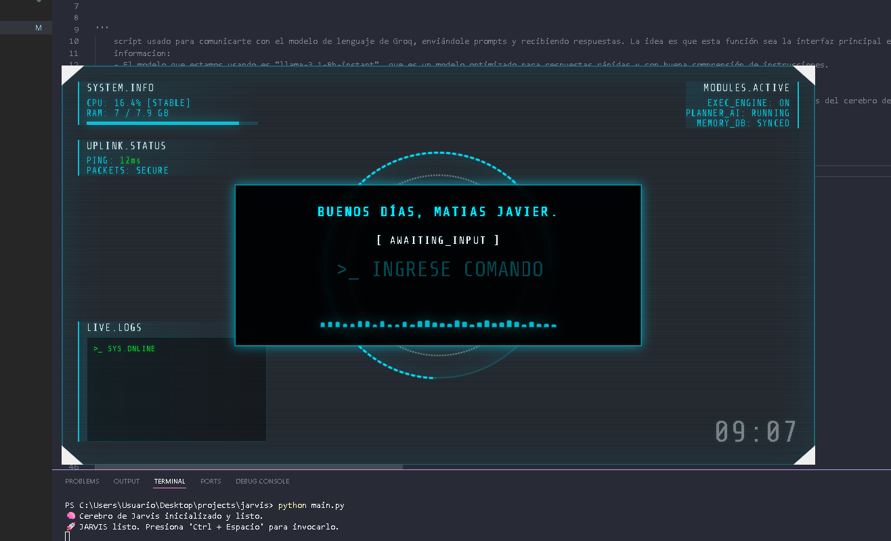
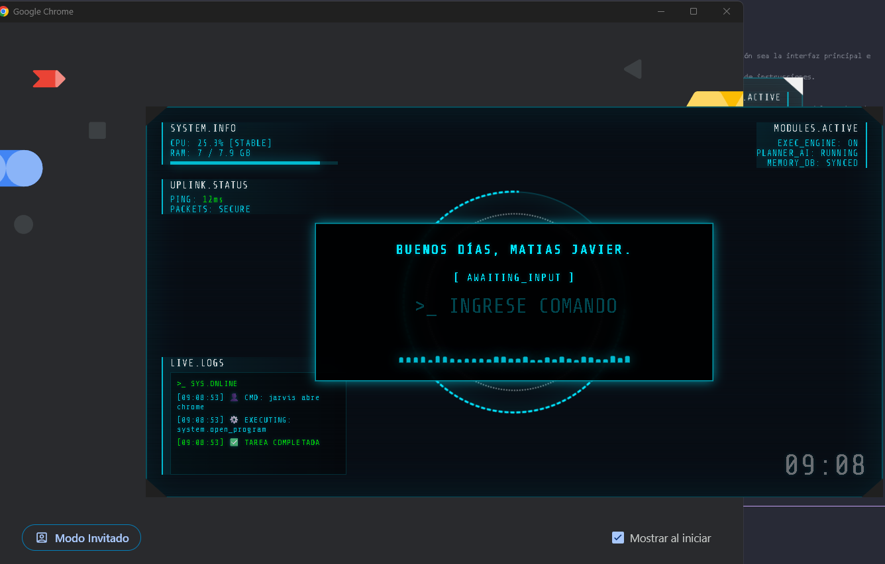
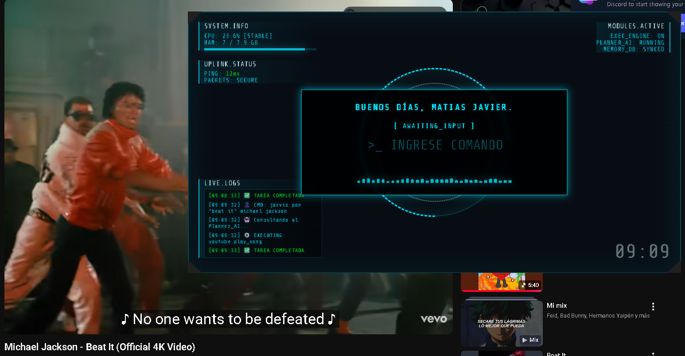

# 🤖 JARVIS - Personal Desktop Asistant


**J.A.R.V.I.S.** es un asistente personal modular inspirado en la estética de Iron Man. Combina una interfaz holográfica inmersiva con un potente motor de automatización capaz de controlar el sistema, gestionar archivos y ejecutar scripts personalizados.

---

## ✨ Características Principales

- **Simulación HUD Holográfico:** Interfaz futurista con efectos de desenfoque y transparencias (Glassmorphism).
- **Monitor de Hardware:** Lectura en tiempo real de CPU y RAM. (librerias python)
- **Ejecutor de Herramientas:** Acceso a herramientas de sistema, navegador, multimedia y automatización de OS.
- **Visualizador de Audio:** Ecualizador digital que reacciona a los procesos de la IA.
- **Live Logs:** Registro en tiempo real de cada acción ejecutada por el asistente.
- **Inicio Fantasma:** Ejecución en segundo plano sin ventanas de consola visibles.

---

## 📸 Visual Showcase

Echa un vistazo al HUD holográfico en acción:

<p align="center">
  
  
  
</p>

<p align="center">
  <i>Vista del panel holográfico con monitoreo de hardware y consola de logs activa.</i>
</p>

---

## 📂 Estructura del Proyecto

El sistema está diseñado de forma modular para facilitar la expansión de habilidades:

* `brain/`: Lógica del Planner y conexión con el LLM (Groq).
* `executor/`: Motor de procesamiento de acciones.
* `tools/`: Librería de habilidades (Navegador, Sistema, Multimedia, etc.).
* `web/`: Frontend del HUD (HTML5/CSS3/JS).
* `jarvis_scripts/`: Gestor de scripts personalizados.
* `utils/`: Indexador de programas y herramientas de soporte.
* `main.py`: Punto de entrada principal del asistente.

---

## 🚀 Instalación y Configuración

1.  **Clonar el repositorio:**
    ```bash
    git clone [https://github.com/bktmatjv/jarvis_project.git](https://github.com/bktmatjv/jarvis_project.git)
    cd jarvis_project
    ```

2.  **Preparar el entorno:**
    ```bash
    python -m venv venv
    .\venv\Scripts\activate
    pip install pywebview psutil keyboard python-dotenv groq
    ```

3.  **Configurar credenciales:**
    Crea un archivo `.env` en la raíz y añade tus llaves:
    ```text
    GROQ_API_KEY=tu_clave_aqui
    ```

---

## ⚙️ Ejecución Silenciosa (Modo Fantasma)

Para iniciar Jarvis sin que aparezca la ventana negra de la terminal, utiliza el script incluido:

1.  Ejecuta `run_main.vbs`.
2.  El asistente se cargará en segundo plano.
3.  Usa el atajo global **`Ctrl + Espacio`** para invocar u ocultar el HUD.

*Para que inicie con Windows, copia un acceso directo de `run_main.vbs` en la carpeta `shell:startup`.*

---
## 📌 Historial de Versiones

| Versión | Estado | Descripción |
| :--- | :--- | :--- |
| **v1.0** | ✅ Stable | Primera versión funcional: HUD base, integración con Groq, monitor de sistema y ejecución de scripts en segundo plano. |
---

## 👨‍💻 Autor

* **bktmatjv** 
